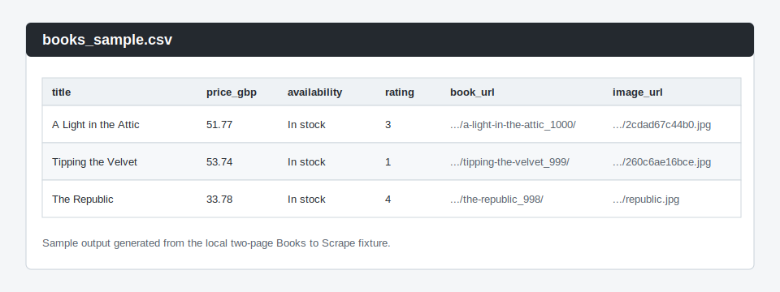

# Public Directory Scraper

A small Python scraper that collects book listing data from [Books to Scrape](https://books.toscrape.com/), cleans the records, and saves them to CSV or Excel.

Books to Scrape is a public sandbox website built for scraping practice.

## What It Scrapes

The scraper extracts book cards from listing pages.

Fields:

- `title`
- `price_gbp`
- `availability`
- `rating`
- `book_url`
- `image_url`

The scraper can follow pagination with `--pages N`, retry temporary fetch failures with `--retries N`, pause between paginated requests with `--delay SECONDS`, remove duplicate books by `book_url`, and write output files with `.csv` or `.xlsx` extensions.

## How To Run

Create a virtual environment and install the project:

```bash
python3 -m venv .venv
.venv/bin/python -m pip install -e ".[dev]"
```

Run against the live site:

```bash
.venv/bin/python -m public_directory_scraper scrape https://books.toscrape.com/ --pages 2 --timeout 10 --retries 1 --delay 1 --output books.csv
```

Save Excel output instead:

```bash
.venv/bin/python -m public_directory_scraper scrape https://books.toscrape.com/ --pages 2 --timeout 10 --retries 1 --delay 1 --output books.xlsx
```

Run against the local fixture without internet access:

```bash
.venv/bin/python -m public_directory_scraper scrape file:///absolute/path/to/books_page.html --pages 2 --output books.csv
```

Fetch a single page with retry and timeout options:

```bash
.venv/bin/python -m public_directory_scraper fetch https://books.toscrape.com/ --timeout 10 --retries 1
```

## Sample Output

The checked-in sample output is available at [sample_outputs/books_sample.csv](sample_outputs/books_sample.csv).

Preview:

| title | price_gbp | availability | rating |
| --- | ---: | --- | ---: |
| A Light in the Attic | 51.77 | In stock | 3 |
| Tipping the Velvet | 53.74 | In stock | 1 |
| The Republic | 33.78 | In stock | 4 |

The full CSV also includes `book_url` and `image_url`.

Screenshot:



## Development

Run tests:

```bash
.venv/bin/python -m unittest discover -s tests
```

Run linting:

```bash
.venv/bin/ruff check src tests
```

Useful local commands:

```bash
.venv/bin/python -m public_directory_scraper
.venv/bin/python -m public_directory_scraper parse tests/fixtures/books_page.html
.venv/bin/python -m public_directory_scraper fetch https://books.toscrape.com/
```

## ETL Configuration

The project is being extended toward a small Postgres ETL pipeline. Current ETL support includes configuration loading, a small Postgres connection wrapper, schema creation helpers, and a raw table loader.

Copy the example environment file when you are ready to configure local database settings:

```bash
cp .env.example .env
```

Current ETL-related environment variables:

- `DATABASE_URL`
- `DEFAULT_PAGES`
- `DEFAULT_TIMEOUT`
- `DEFAULT_RETRIES`
- `DEFAULT_DELAY`

## Project Layout

```text
.
├── src/public_directory_scraper/
│   ├── __init__.py
│   ├── __main__.py
│   ├── config.py
│   ├── cleaner.py
│   ├── database.py
│   ├── exporter.py
│   ├── fetcher.py
│   ├── loader.py
│   ├── parser.py
│   ├── schema.py
│   └── scraper.py
├── tests/
│   ├── fixtures/
│   │   ├── books_page.html
│   │   ├── catalogue/
│   │   │   └── page-2.html
│   │   ├── listings.html
│   │   └── simple_listing.html
│   ├── test_books_fixture.py
│   ├── test_cleaner.py
│   ├── test_config.py
│   ├── test_database.py
│   ├── test_cli_entrypoint.py
│   ├── test_exporter.py
│   ├── test_fetcher.py
│   ├── test_loader.py
│   ├── test_parser.py
│   ├── test_schema.py
│   ├── test_scraper.py
│   └── test_import.py
├── sample_outputs/
│   └── books_sample.csv
├── docs/
│   └── screenshots/
│       └── books-output.svg
├── .env.example
├── pyproject.toml
├── README.md
└── DEV_LOG.md
```

## How It Works

- `fetcher.py` downloads one page.
- `parser.py` extracts raw listing records from HTML.
- `cleaner.py` normalizes prices, ratings, text, URLs, and duplicates.
- `scraper.py` connects fetching, parsing, cleaning, and pagination.
- `exporter.py` writes records to CSV or Excel.
- `config.py` reads future ETL settings from environment variables.
- `database.py` opens future Postgres connections.
- `loader.py` inserts raw scraped records into Postgres.
- `schema.py` creates future raw and cleaned Postgres tables.
- `__main__.py` exposes the command-line interface.

## Limitations

- The parser is tailored to Books to Scrape listing pages.
- Pagination is limited by the `--pages` value.
- Retries are immediate; there is no exponential backoff.
- Crawl delay is fixed between paginated requests.
- The local CLI allows `file://` URLs for fixture-based development; production reuse should restrict input URLs to trusted `http` or `https` targets.
- ETL raw loading exists, but cleaned-table loading and a full ETL command are not implemented yet.
- There is no live-site change detection yet.
- The screenshot is a static preview of the sample output.
- The sample CSV is static and should be refreshed if output fields change.
